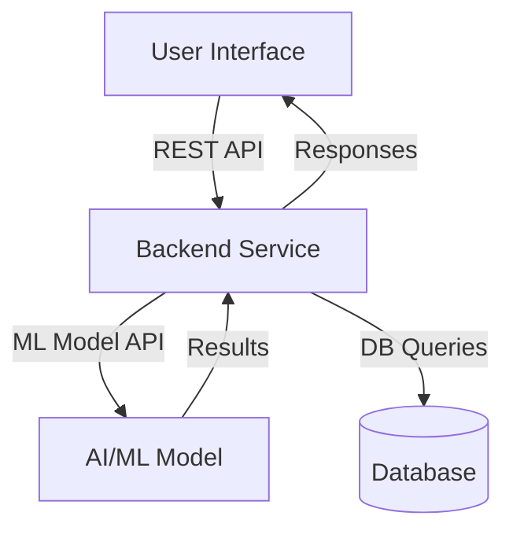

# System Architecture

## High-Level Architecture Diagram

## Component Interactions and Dependencies

- **User Interface (UI):**
  - Interacts with Backend via REST API.
  - Displays data and receives user input.
- **Backend Service:**
  - Handles business logic, authentication, and API requests.
  - Communicates with ML Model for predictions.
  - Reads/writes data to Database.
- **AI/ML Model:**
  - Receives data from Backend, returns predictions/results.
  - Can be a microservice or integrated module.
- **Database:**
  - Stores user data, results, logs, and other persistent information.
  - Accessed by Backend for CRUD operations.

## Data Flow Between System Components

1. User interacts with UI (web/app).
2. UI sends request to Backend (REST API).
3. Backend processes request, may query Database or call ML Model.
4. ML Model returns results to Backend.
5. Backend sends response to UI.
6. UI displays results to user.

## API Contracts Between Modules

| Endpoint         | Method | Request Body         | Response Body        | Description                  |
|------------------|--------|---------------------|----------------------|------------------------------|
| /predict         | POST   | {input_data}        | {prediction}         | Get prediction from ML model |
| /user/login      | POST   | {username, password}| {token}              | User authentication          |
| /user/profile    | GET    | -                   | {profile_data}       | Get user profile             |
| /data/save       | POST   | {data}              | {status}             | Save data to database        |
| /data/fetch      | GET    | -                   | {data_list}          | Fetch data from database     |

---
This document provides a concise, maintainable, and extensible foundation for your system architecture. You can expand each section as the project evolves.
