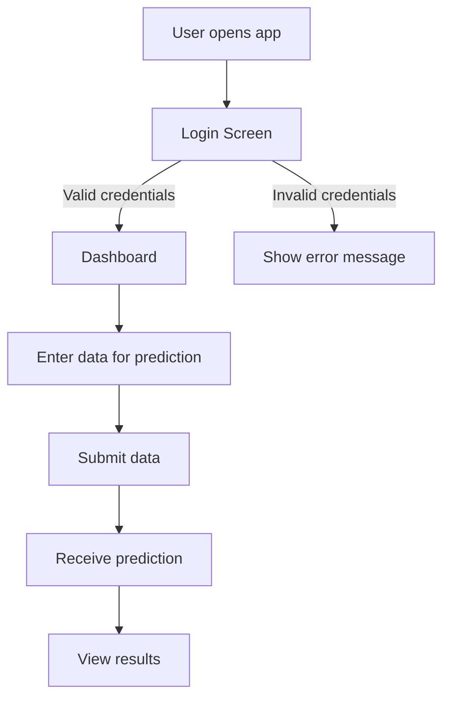
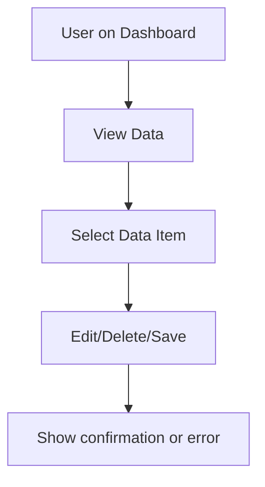

# User Experience Planning

## User Flow Diagrams

### Login and Prediction Flow

### Data Management Flow

## Basic UI Wireframes (Text Sketch)

- **Login Screen:**
  - Username field
  - Password field
  - Login button
  - Error message area

- **Dashboard:**
  - Navigation bar (Home, Predict, Data, Profile)
  - Main area: Data input form, prediction results
  - Sidebar: Recent activity, notifications

- **Data Management:**
  - List of data items
  - Edit/Delete buttons next to each item
  - Add new data button

## Session Management Approach

- Use secure tokens (JWT or session cookies) for authentication.
- Store session tokens in HTTP-only cookies for web apps.
- Implement session timeout and renewal mechanisms.
- Validate session on each API request.

## Error Handling and Feedback Mechanisms

- Display clear error messages for invalid actions (e.g., login failure, invalid data input).
- Use toast notifications or modal dialogs for feedback.
- Log errors on the backend for monitoring and debugging.
- Provide actionable suggestions in error messages (e.g., "Please check your input format").
- Ensure accessibility for all feedback (screen reader support, color contrast).

---
This document provides a foundation for user experience planning. You can expand wireframes and flows as the UI design matures.
